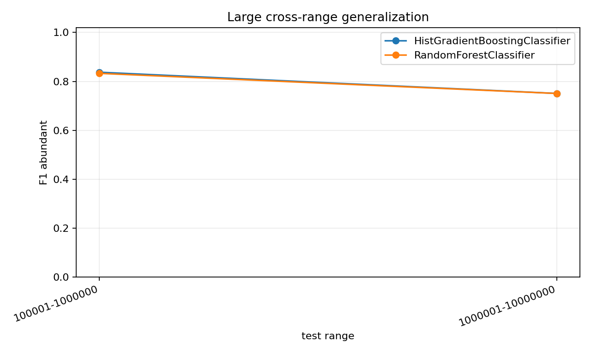
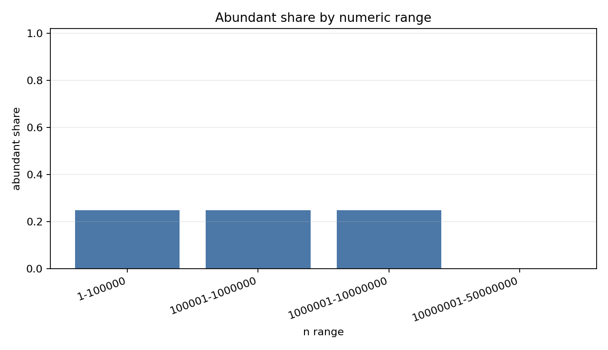

# Number Theory Features × Machine Learning

This repository is a small experimental mathematics / machine-learning project. It studies whether an integer `n` can be classified as an **abundant number** from number-theoretic features such as divisor count, number of prime factors, and the minimum / maximum prime factor.

The central question is not just whether `sigma(n) / n` determines the class. That is almost the definition. Instead, the main experiments ask whether the **prime-factor structure** of `n` contains enough information for a machine-learning model to predict whether `n` is abundant.

## What this project studies

For a positive integer `n`, let `sigma(n)` be the sum of all positive divisors of `n`.

| class | definition |
|---|---|
| deficient | `sigma(n) < 2n` |
| perfect | `sigma(n) = 2n` |
| abundant | `sigma(n) > 2n` |

Because perfect numbers are extremely rare, most machine-learning experiments are treated as binary classification:

```text
abundant vs non-abundant
```

The project converts each integer into a feature vector and trains classifiers to learn the relationship:

```text
number-theoretic features of n  ->  abundant / non-abundant
```

## Key idea

`sigma_ratio = sigma(n) / n` is useful for analysis, but it is too close to the label definition. If `sigma_ratio` is used as an input feature, the model can simply learn:

```text
sigma_ratio > 2  ->  abundant
```

Therefore, the main research experiments **exclude `sigma_ratio` from the model input**. This makes the task more meaningful: the model must rely on features such as `tau_n`, `omega_n`, `Omega_n`, `min_prime_factor`, and `max_prime_factor`.

## Features

| feature | meaning |
|---|---|
| `n` | integer value |
| `log_n` | logarithm of `n` |
| `sigma_n` | sum of divisors |
| `sigma_ratio` | `sigma(n) / n`, used for analysis but usually excluded from ML input |
| `tau_n` | number of divisors |
| `omega_n` | number of distinct prime factors |
| `Omega_n` | number of prime factors counted with multiplicity |
| `min_prime_factor` | smallest prime factor |
| `max_prime_factor` | largest prime factor |
| `label` | `deficient`, `perfect`, or `abundant` |

Example:

```text
60 = 2^2 × 3 × 5
omega_n = 3
Omega_n = 4
min_prime_factor = 2
max_prime_factor = 5
tau_n = 12
```

## How the machine learning works

The model is trained from many examples. Each row is one integer `n`, and the label tells the model whether that integer is abundant.

During training, the model learns statistical patterns such as:

- numbers with many divisors are more likely to be abundant;
- numbers with more prime-factor structure are more likely to be abundant;
- small prime factors often make the divisor sum relatively large;
- the same `omega_n` can still contain both abundant and non-abundant numbers, so the exact factor structure matters.

The model does not prove a number-theoretic theorem. It learns a predictive rule from data. This is why cross-range testing is important: a model that works only inside the training range may not have learned a robust numerical pattern.

| model | intuition |
|---|---|
| Random Forest | many decision trees vote using different feature splits |
| HistGradientBoosting | many weak rules are added sequentially to correct earlier mistakes |

## Research questions

1. How much better are machine-learning models than simple rule baselines?
2. Can the model still predict abundant numbers when `omega_n` is fixed?
3. Can the model still work after removing strong features such as `sigma_ratio` and `tau_n`?
4. Can the model classify boundary cases where `sigma_ratio` is close to 2?
5. Does a model trained on small integers generalize to much larger integers?

## Current results

### Dataset scale

The current large-scale run generated features for `1..10,000,000`.

| label | count | share |
|---|---:|---:|
| deficient | 7,523,259 | 0.752326 |
| perfect | 4 | 0.0000004 |
| abundant | 2,476,737 | 0.247674 |

Range-level distribution:

| range | total | abundant | abundant share |
|---|---:|---:|---:|
| `1-100000` | 100,000 | 24,795 | 0.247950 |
| `100001-1000000` | 900,000 | 222,750 | 0.247500 |
| `1000001-10000000` | 9,000,000 | 2,229,192 | 0.247688 |

### Rule baseline

| rule | accuracy | F1 abundant |
|---|---:|---:|
| `tau_n >= 12` | 0.8286 | 0.7273 |
| `tau_n >= 24` | 0.8696 | 0.6650 |
| `omega_n >= 4` | 0.8222 | 0.5816 |
| `omega_n >= 5` | 0.7695 | 0.1345 |

Simple rules have some explanatory power, but they are much weaker than the machine-learning models.

### Feature ablation

| feature set | accuracy | F1 abundant |
|---|---:|---:|
| `full_without_sigma_ratio` | 0.9838 | 0.9671 |
| `no_sigma_no_tau` | 0.9814 | 0.9623 |
| `prime_structure_only` | 0.9451 | 0.8854 |
| `omega_only` | 0.8276 | 0.5988 |
| `size_only` | 0.7507 | 0.0000 |

The model is not simply reading the definition through `sigma_ratio`, and it is not only counting divisors through `tau_n`. Prime-factor structure itself carries strong predictive information.

### Fixed omega experiment

| omega_n | rows | accuracy | F1 abundant |
|---:|---:|---:|---:|
| 2 | 33,759 | 0.9998 | 0.9910 |
| 3 | 38,844 | 0.9936 | 0.9897 |
| 4 | 15,855 | 0.9198 | 0.9383 |
| 5 | 1,816 | 0.9912 | 0.9955 |

The `omega_n = 4` case is relatively difficult, but the model still performs well. This means the learned pattern is more detailed than `omega_n` alone.

### Boundary cases

Boundary cases use only integers where `sigma_ratio` is close to 2. `sigma_ratio` is used only to select the samples, not as a model input.

| sigma_ratio window | rows | accuracy | F1 abundant |
|---|---:|---:|---:|
| `1.80-2.20` | 19,036 | 0.9239 | 0.9199 |
| `1.90-2.10` | 9,278 | 0.9328 | 0.9420 |
| `1.95-2.05` | 5,541 | 0.9639 | 0.9739 |

Prime-factor structure remains informative even near the abundant / non-abundant decision boundary. The result should still be interpreted carefully because narrower windows also change the class balance.

### Cross-range generalization

Training range:

```text
1-100000
```

Large-scale test results:

| model | test range | test rows | accuracy | F1 abundant |
|---|---|---:|---:|---:|
| HistGradientBoosting | `100001-1000000` | 200,000 | 0.9062 | 0.8375 |
| RandomForest | `100001-1000000` | 200,000 | 0.9026 | 0.8328 |
| HistGradientBoosting | `1000001-10000000` | 200,000 | 0.8364 | 0.7507 |
| RandomForest | `1000001-10000000` | 200,000 | 0.8361 | 0.7505 |

The model learns useful number-theoretic structure, but performance drops as the test range moves farther away from the training range. This makes cross-range generalization the most interesting open direction in the project.





## Project structure

```text
README.md
requirements.txt
.gitignore
src/
  generate_dataset.py
  analyze_distribution.py
  train_models.py
  rule_baselines.py
  feature_ablation.py
  train_fixed_omega.py
  train_boundary_cases.py
  train_cross_range.py
  analyze_large_distribution.py
  sample_large_dataset.py
  train_large_cross_range.py
  number_theory_features.py
  utils.py
data/
  chunks/        # ignored; local Parquet feature chunks
  samples/       # ignored; local sampled datasets
figures/
results/
notebooks/
```

## Setup

```bash
pip install -r requirements.txt
```

The implementation avoids calling SymPy's `factorint`, `divisor_sigma`, or `divisor_count` for every `n`. Instead, it uses an SPF sieve and Numba-accelerated range factorization so that staged runs can scale to larger datasets.

## Basic commands

Generate and analyze 100,000 rows:

```bash
python src/generate_dataset.py --max-n 100000 --chunk-size 100000
python src/analyze_distribution.py --data-dir data/chunks
```

Run the standard research experiments:

```bash
python src/rule_baselines.py --data-dir data/chunks
python src/feature_ablation.py --data-dir data/chunks --sample-size 50000
python src/train_fixed_omega.py --data-dir data/chunks
python src/train_boundary_cases.py --data-dir data/chunks
```

Run cross-range testing up to 1,000,000:

```bash
python src/generate_dataset.py --max-n 1000000 --chunk-size 100000
python src/train_cross_range.py --data-dir data/chunks --train-max-n 100000 --test-min-n 100001 --test-max-n 1000000 --max-test-rows 900000
```

## Large-scale experiments

Large raw feature chunks are written to `data/chunks/` as Parquet files and are intentionally not committed to GitHub. Sampled datasets under `data/samples/` are also ignored.

Recommended step 1: verify 1,000,000 rows.

```powershell
python src/generate_dataset.py --max-n 1000000 --chunk-size 1000000
python src/analyze_large_distribution.py --data-dir data/chunks
python src/train_large_cross_range.py --data-dir data/chunks --train-max-n 100000 --test-ranges "100001:1000000" --sample-per-range 200000
```

Recommended step 2: extend to 10,000,000 rows.

```powershell
python src/generate_dataset.py --max-n 10000000 --chunk-size 1000000
python src/analyze_large_distribution.py --data-dir data/chunks
python src/sample_large_dataset.py --data-dir data/chunks --output-path data/samples/sample_10m.parquet --sample-size 500000 --random-state 42
python src/train_large_cross_range.py --data-dir data/chunks --train-max-n 100000 --test-ranges "100001:1000000,1000001:10000000" --sample-per-range 200000
```

Optional advanced step: extend to 50,000,000 rows only when disk space and runtime are acceptable.

```powershell
python src/generate_dataset.py --max-n 50000000 --chunk-size 1000000
python src/analyze_large_distribution.py --data-dir data/chunks
python src/train_large_cross_range.py --data-dir data/chunks --train-max-n 100000 --test-ranges "100001:1000000,1000001:10000000,10000001:50000000" --sample-per-range 200000
```

Do not run the 50M command casually. The generator prints estimated SPF memory, per-chunk working memory, and rough Parquet disk usage before generation. It also skips chunks that already exist, so staged runs can continue without overwriting previous data.

## Outputs

Main result files:

```text
results/rule_baselines.csv
results/feature_ablation_metrics.csv
results/fixed_omega_metrics.csv
results/boundary_case_metrics.csv
results/cross_range_metrics.csv
results/large_distribution_summary.csv
results/large_omega_abundant_rate.csv
results/large_range_summary.csv
results/large_cross_range_metrics.csv
```

Main figures:

```text
figures/rule_baseline_comparison.png
figures/feature_ablation_accuracy.png
figures/feature_ablation_f1.png
figures/fixed_omega_accuracy.png
figures/boundary_case_accuracy.png
figures/cross_range_comparison.png
figures/large_omega_abundant_rate.png
figures/large_range_abundant_share.png
figures/large_cross_range_f1.png
```

## Interpretation

The experiments suggest the following.

- Simple rules such as `omega_n >= 4` or `tau_n >= 12` are useful but much weaker than machine-learning models.
- Excluding `sigma_ratio` is necessary because it is almost the label definition.
- High performance after removing `tau_n` suggests that the model uses more than divisor count.
- Fixed-`omega_n` experiments show that the model learns finer structure than the number of distinct prime factors alone.
- Boundary-case experiments show that prime-factor structure remains informative near the decision boundary.
- Cross-range performance drops from the 1M range to the 10M range, suggesting that generalization across integer ranges is nontrivial.

## Limitations

- Perfect numbers are too rare for stable multi-class learning.
- Boundary-case results depend on the sample window and class balance.
- The model learns predictive patterns, not mathematical proofs.
- The current 10M experiment uses sampled high-range test sets for ML evaluation.
- The 50M experiment is supported by the workflow but has not yet been run.

## Future work

- Run the full staged experiment up to `50,000,000`.
- Analyze the difficult `omega_n = 4` group in more detail.
- Add explicit prime-exponent-pattern features.
- Add ratio features such as `min_prime_factor / max_prime_factor`.
- Control class balance in boundary-case experiments.
- Compare training ranges such as `1e5 -> 1e6`, `1e6 -> 1e7`, and `1e7 -> 5e7`.
- Use the project as a lightweight example of machine learning for experimental number theory.
